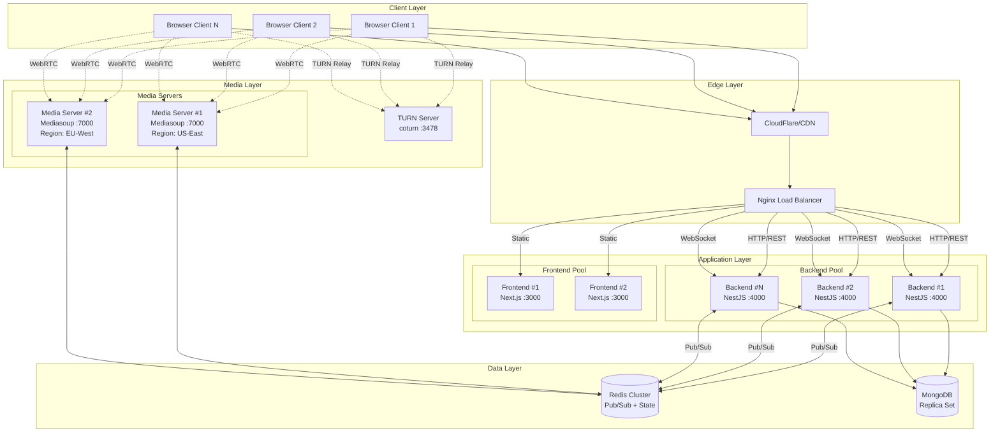

# MeetClone Horizontal Scaling Architecture

## Overview

This document describes the architecture for scaling MeetClone to support 1000+ concurrent users across multiple server instances with high availability and resilience.

## Architecture Diagram



## Component Architecture

### 1. Load Balancer (Nginx)

**Responsibilities:**
- HTTP/HTTPS termination
- Load balancing across backend instances
- WebSocket sticky sessions (ip_hash)
- Rate limiting
- SSL offloading

**Configuration:**
- REST API: `least_conn` algorithm
- WebSocket: `ip_hash` for sticky sessions (required for Socket.IO)
- Frontend: `least_conn` algorithm

### 2. Backend Servers (NestJS)

**Scaling Strategy:**
- Horizontally scalable with Redis-backed state
- Stateless design - no in-memory meeting state
- Socket.IO uses Redis adapter for cross-instance messaging

**Key Changes for Scaling:**
```typescript
// Before: In-memory state (single instance only)
private readonly rooms = new Map<string, MeetingRoom>();

// After: Redis-backed state (multi-instance)
await redis.hset(`meeting:${meetingId}:participants`, participantId, JSON.stringify(presence));
```

**Redis Key Patterns:**
| Key Pattern | Type | Purpose |
|-------------|------|---------|
| `meeting:{id}:participants` | Hash | Participant presence data |
| `socket:{socketId}` | String | Socket → Meeting/Participant mapping |
| `meeting:{id}:server` | String | Which server instance handles meeting |
| `server:{instanceId}:meetings` | Set | Meetings on this server instance |

### 3. Media Servers (Mediasoup)

**Scaling Strategy:**
- **Vertical scaling preferred** - Media processing is CPU-intensive
- Deploy 1 media server per physical server/VM
- Use multiple workers (1 per CPU core)
- Geographic distribution for latency optimization

**Capacity Planning:**
| Component | Per Server | Bottleneck |
|-----------|------------|------------|
| Workers | 4-8 (CPU cores) | CPU |
| Concurrent Participants | ~100-200 | Bandwidth |
| Rooms | ~50-100 | Router memory |

**Room-to-Worker Assignment:**
```typescript
// Round-robin worker assignment
getNextWorker(): Worker {
  const worker = this.workers[this.nextWorkerIdx];
  this.nextWorkerIdx = (this.nextWorkerIdx + 1) % this.workers.length;
  return worker;
}
```

### 4. TURN Server (coturn)

**Purpose:**
- NAT traversal for clients behind restrictive firewalls
- Relay media when direct P2P/SFU connection fails

**Configuration:**
```
# Use time-limited credentials from REST API
use-auth-secret
static-auth-secret=${TURN_SECRET}

# UDP relay only (recommended)
no-tcp-relay
```

### 5. Redis

**Usage:**
- **Pub/Sub:** Socket.IO adapter for cross-instance messaging
- **State Storage:** Meeting participants, presence data
- **Caching:** User sessions, meeting metadata

**Deployment:**
- Redis Sentinel for HA (3 nodes minimum)
- Or Redis Cluster for larger scale

### 6. MongoDB

**Role:**
- Persistent storage for users, meetings, chat history
- Not in hot path for real-time operations

**Deployment:**
- Replica set (3 nodes) for HA
- Read replicas for scaling reads

## Scaling Thresholds

| Metric | Action Trigger | Scaling Response |
|--------|---------------|------------------|
| Backend CPU > 70% | Scale out | Add backend instance |
| Backend memory > 80% | Scale out | Add backend instance |
| Media CPU > 80% | Scale out | Add media server |
| WebSocket connections > 5000/instance | Scale out | Add backend instance |
| Redis memory > 80% | Scale up | Increase Redis memory |

## Deployment Strategy

### Docker Compose (Development/Small Scale)

```bash
# Deploy with 3 backend instances
docker-compose -f docker-compose.prod.yml up -d --scale backend=3

# Check status
docker-compose -f docker-compose.prod.yml ps
```

### Kubernetes (Production)

```yaml
# Backend Deployment
apiVersion: apps/v1
kind: Deployment
metadata:
  name: meetclone-backend
spec:
  replicas: 3
  selector:
    matchLabels:
      app: meetclone-backend
  template:
    spec:
      containers:
      - name: backend
        resources:
          requests:
            cpu: "250m"
            memory: "256Mi"
          limits:
            cpu: "1000m"
            memory: "512Mi"
---
# Horizontal Pod Autoscaler
apiVersion: autoscaling/v2
kind: HorizontalPodAutoscaler
metadata:
  name: meetclone-backend-hpa
spec:
  scaleTargetRef:
    apiVersion: apps/v1
    kind: Deployment
    name: meetclone-backend
  minReplicas: 2
  maxReplicas: 10
  metrics:
  - type: Resource
    resource:
      name: cpu
      target:
        type: Utilization
        averageUtilization: 70
```

## Performance Considerations

### 1. WebSocket Connection Limits

Each backend instance can handle ~10,000-20,000 WebSocket connections.

**Tuning:**
```bash
# Increase file descriptor limit
ulimit -n 65535

# Sysctl tuning
net.core.somaxconn = 65535
net.ipv4.tcp_max_syn_backlog = 65535
```

### 2. Redis Performance

**Expected Throughput:**
- ~100,000 operations/second per node
- Latency: < 1ms for most operations

**Optimization:**
```bash
# Disable persistence for pub/sub-only workloads
save ""
appendonly no
```

### 3. Media Server Bandwidth

**Per Participant:**
- Video: ~1.5 Mbps (720p)
- Audio: ~32 kbps (Opus)

**For 100 participants in same room:**
- Inbound: ~150 Mbps (100 × 1.5)
- Outbound: ~15 Gbps (100 × 100 × 1.5)

This is why SFU architecture is critical - participants receive streams directly from server, not all-to-all.

## Bottleneck Analysis

### Primary Bottlenecks

| Component | Bottleneck | Mitigation |
|-----------|-----------|------------|
| Media Server | CPU (encoding/decoding) | Vertical scale, simulcast |
| Media Server | Bandwidth | Geographic distribution |
| Backend | WebSocket connections | Horizontal scale |
| Redis | Memory | Cluster, TTL on keys |

### Secondary Bottlenecks

| Component | Bottleneck | Mitigation |
|-----------|-----------|------------|
| MongoDB | Write throughput | Sharding |
| TURN | Bandwidth | Multiple TURN servers |
| Nginx | Connection handling | Upstream keepalive |

## Failure Modes & Recovery

### Backend Instance Failure

1. Health check fails (30s timeout)
2. Nginx removes from upstream pool
3. Clients reconnect to healthy instance
4. Redis state preserved - no data loss

### Media Server Failure

1. All participants in rooms on that server disconnected
2. Clients trigger reconnect flow
3. New media server handles reconnection
4. Meeting state in Redis guides room recreation

### Redis Failure

1. Graceful degradation - new connections fail
2. Existing WebSocket connections continue (local memory)
3. Redis Sentinel promotes replica
4. Normal operation resumes (~30s)

## Monitoring & Observability

### Health Endpoints

| Endpoint | Purpose | Check Interval |
|----------|---------|---------------|
| `/health/live` | Process alive | 30s |
| `/health/ready` | Dependencies ready | 30s |
| `/health` | Full status | 60s |
| `/health/metrics` | Prometheus scrape | 15s |

### Key Metrics to Monitor

```prometheus
# Backend
meetclone_active_meetings
meetclone_active_participants
meetclone_websocket_connections

# Media Server
meetclone_media_workers
meetclone_media_rooms
meetclone_media_peers
meetclone_media_producers
meetclone_media_consumers
```

### Alerting Rules

```yaml
- alert: HighCPUUsage
  expr: avg(rate(container_cpu_usage_seconds_total{name="backend"}[5m])) > 0.8
  for: 5m
  labels:
    severity: warning

- alert: MediaServerDown
  expr: up{job="media"} == 0
  for: 1m
  labels:
    severity: critical

- alert: HighWebSocketConnections
  expr: meetclone_websocket_connections > 8000
  for: 5m
  labels:
    severity: warning
```

## Capacity Planning

### For 1000 Concurrent Users

| Component | Count | Specs |
|-----------|-------|-------|
| Backend | 3 | 2 vCPU, 2GB RAM |
| Media Server | 2 | 8 vCPU, 8GB RAM |
| Redis | 1 (+ replica) | 2 vCPU, 4GB RAM |
| MongoDB | 3 (replica set) | 2 vCPU, 4GB RAM |
| TURN | 1-2 | 2 vCPU, 2GB RAM |

### For 10,000 Concurrent Users

| Component | Count | Specs |
|-----------|-------|-------|
| Backend | 10 | 4 vCPU, 4GB RAM |
| Media Server | 10 (geo-distributed) | 16 vCPU, 16GB RAM |
| Redis Cluster | 6 nodes | 4 vCPU, 16GB RAM |
| MongoDB Cluster | Sharded | Variable |
| TURN | 5 (geo-distributed) | 4 vCPU, 4GB RAM |

## Quick Start

```bash
# 1. Set environment variables
export JWT_SECRET="your-production-secret"
export MONGO_ROOT_PASSWORD="secure-password"
export TURN_SECRET="turn-server-secret"
export PUBLIC_IP="your-server-ip"

# 2. Deploy
docker-compose -f docker-compose.prod.yml up -d

# 3. Scale as needed
docker-compose -f docker-compose.prod.yml up -d --scale backend=3

# 4. Check health
curl http://localhost/api/health
```
